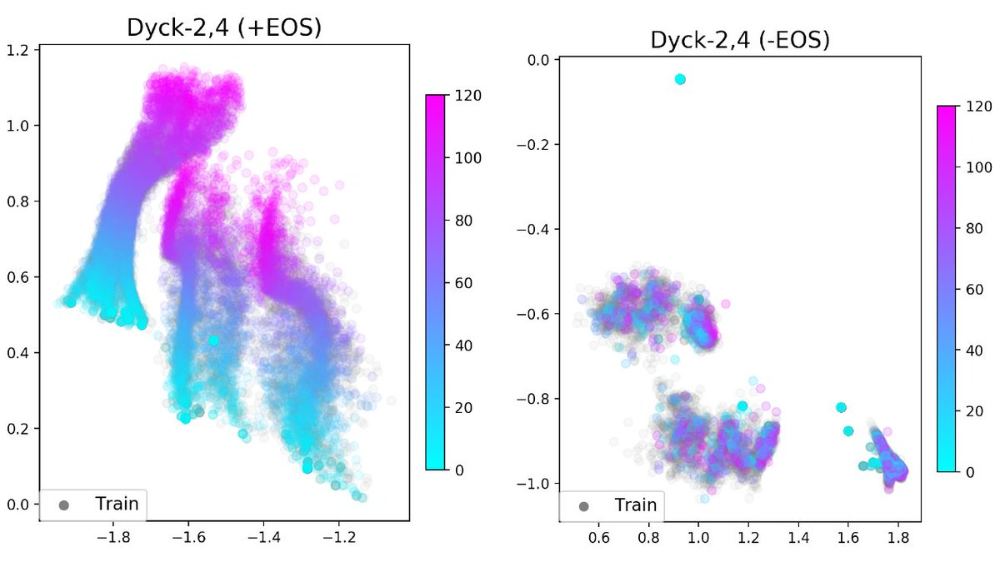

# eos-decision



Current neural models are unable to generalize to sequences longer than those seen at training time, which is a barrier to achieving human-like language understanding. This problem is compounded by the widespread practice of using an end-of-sequence (`[EOS]`) token to mark the end of a training sequence. When these tokens are removed, models show a surprising ability to generalize to longer sequences in a number of domains. This repository contains experiments for investigating this phenomenon in three different settings.

The publication is available [here](https://nlp.stanford.edu/pubs/newman2020extrapolation.pdf).


## Installing
1. Clone the repository
```bash
git clone https://github.com/bnewm0609/eos-decision/
cd eos-decision
```

2. Install required packages
```bash
pip install -r requirements.txt
```

3. (Optional) Transformer Experiments
To run the Transformer experiments, install the slightly modified version of the OpenNMT framework which is included as a git submodule of this repo. To install the modified version of the package, run:
```bash
cd OpenNMT-py
python setup.py install
```

## Code structure

* configs: Stores the configuration files for the experiments. The fields of these files are detailed below.
* data: Stores the data from the tasks. All generated data is put in a subfolder in this directory.
* models: Is created when models are trained to store model weights.
* results: Is created when models are trained to store experiment results.
* src: Stores the code for running an experiment from a config file.
* scripts: Stores an assortment of scripts for running groups of experiments, generating and preprocessing data and generating results.
* tools/shared: Tokenization tools for the MT experiments written by by Philipp Koehn and Josh Schroeder. (Available at http://www.statmt.org/europarl/v7/tools.tgz)


## Running Dyck-(k,m) experiments
### 1. Generating the data
To generate sequences, run:
```bash
sh scripts/dyck_km/generate_data.sh
```

### 2. Training the models
To train all of the models, use the `run_all` script:
```bash
python scripts/shared/run_all.py configs/dyck_km/all_experiments/ train-seq2seq
```
This will train all of the -EOS and +EOS models, with 5 random seeds of each. Use the `--white_list` flag to train only models whose configs contain a substring and the `--black_list` flag to train only models whose configs do not contain a substring.

### 3. Results and Plots
To collect the mean close-bracket accuracy for an experiment, run the script here:
```bash
python scripts/dyck_km/collect_results.py configs/dyck_km/all_experiments/dyck{m}2-{eos,no_eos}/
```

To gather perplexity, the parameter `--metric ppl` can be added.

To generate the plots seen in the paper run:
```bash
python scripts/dyck_km/generate_plots.py --save_hidden_states
```

### 4. EOS predictions
To train the probes to predict where sequences end, we can use the `run_all` script:
```bash
python scripts/shared/run_all.py configs/dyck_km/all_probes/ train-truncation
```
There are probes for +EOS and -EOS models separately for each of the 3 values of `m`, and 5 random seeds, giving 30 probes total.

The `scripts/dyck_km/collect_results.py` script can be used to collect these results as well with the `--metric probe_acc` flag.

## Running the SCAN experiments
Unlike the Dyck-(k,m) data, the SCAN data is already included in the repo.

### 1. Running Experiments
To run the LSTM experiments, run:
```bash
python scripts/shared/run_all.py configs/scan/lstm_experiments train-seq2seq
```

As long as the OpenNMT submodule is installed, the transformer experiments are almost as easy. First, train the -EOS and +EOS models:
```bash
python scripts/shared/run_all.py configs/scan/transformer_experiments train-onmt --black_list "+eos_des+"
```
This command also generates the outputs for the +EOS model and the -EOS+Oracle model.

To generate the output for the +EOS+Oracle model, run this command:
```bash
python scripts/shared/run_all.py configs/scan/transformer_experiments generate-onmt --white_list "+eos_des+"
```

At this point, the transformer-generated outputs are saved to disk, so we have to run the evaluations for them. We can run the oracle length evaluation with the BLEU metric with the command:
```bash
python scripts/shared/run_all.py configs/scan/transformer_experiments eval
```

### 2. Results and Plots:
To generate the SCAN result tables in the paper, run:
```bash
python scripts/scan/collect_results.py configs/scan/{lstm,transformer}_experiments
```
To get the lstm or transformer results respectively.

To generate the plots, run:
```bash
python scripts/dyck_km/generate_plots.py --save_hidden_states
```

## Running MT experiments
### 1. Preparing the Data
To download and preprocess the data, run
```bash
sh scripts/translation/generate_data.sh
```
This will download the Europarl German-English training set from http://www.statmt.org/europarl/v9/training/, sample 500,000 examples, and partition it into a the length splits with length cutoffs of `10`, `15`, and `25` tokens.


### 2. Running the Experiments
Both the Transformer and LSTM experiments are conducted using OpenNMT, so there are three commands to run them all.

First, to train the -EOS and +EOS models and capture their generations:
```bash
python scripts/shared/run_all.py configs/translation/{lstm,transformer}_experiments train-onmt --black_list "+eos_des+"
```

Next, to capture the generated sequences from the +EOS+Oracle models:
```bash
python scripts/shared/run_all.py configs/translation/{lstm,transformer}_experiments generate-onmt --white_list "+eos_des+"
```

Finally, to evaluate using our the Oracle BLEU metric, run:
```bash
python scripts/shared/run_all.py configs/translation/{lstm,transformer}_experiments eval
```


## Installing the OpenNMT git submodule
We are using a slightly modified version of OpenNMT framework, which is included as a git submodule of this repo. To install the modified version of the package, run:
```bash
cd OpenNMT-py
python setup.py install
```
See [the OpenNMT repository](https://github.com/OpenNMT/OpenNMT-py) for more information.

The difference between the original repo and ours is just that we add a `-disable_eos_sampling` to the `preprocess` and `translate` scripts. In `preprocess`, this option replaces the `EOS` token with a padding token, and in the `translate` script, it prevents the model from predicting `EOS` tokens by setting their probability to 0.

**Note**: this is different from the custom code, where the `use_eos` options specifies what the data looks like and the `disable_eos_sampling` specifies what the decoder should do. To prevent naming conflicts, in the script for running OpenNMT experiments, we use the `lm.use_eos` entry of the config to decide whether to pass `disable_eos_samplign` to the `preprocess` script and the `lm.disable_eos_sampling` entry to decide whether to pass `disable_eos_sampling` to the `translate` script. This modification leads to behavior consistent with the custom experiments.

For information about preprocessing, training, and translating, see the [OpenNMT documentation](https://opennmt.net/OpenNMT-py/main.html) for more information.


For evaluations, we load the OpenNMT model outputs into a lookup-table-based model so we can evaluate them using the same methods as our custom-trained models. The `lm_type` in the `lm` section of the config specifies this lookup-table-based model.

## Experiment Configs
Here is the overall structure of an experiment config:

### Data
First comes the information about the dataset:
```yaml
data:
  dataset_type: [selects the src.data.Dataset class to load in]
  dataset_name: [labels in the model and results dirs, used for different splits]
  train_path: [path to training data]
  dev_path: [path to dev data]
  test_path: [path to test data]
  input_vocab_path: [path to preprocessed source vocab json]
  target_vocab_path: [path to preprocess target vocab json]
```
The `dataset_type` will be either `scan`, `mt`, `dyckmk`, or `dyckkm_ending` .

For Dyck-(k, m) experiments, the data section of config should look like:
```yaml
data:
  dataset_type: dyckmk # or dyckkm_ending for the EOS tokens
  dataset_name: dyckmk{m}2 # m is the
  train_path: [path to training data]/small_train.txt
  dev_path: [path to dev data]/dev.txt
  test_path: [path to test data]/tasks_test_length.txt
```

For SCAN experiments, the data section of the config should look similar:
```yaml
data:
  dataset_type: scan
  dataset_name: scan{k}ls # this can be anything, but should be descriptive, where k is the length cutoff
  train_path: [path to training data]/small_train.txt
  dev_path: [path to dev data]/dev.txt
  test_path: [path to test data]/tasks_test_length.txt
```
The vocabulary paths can point to wherever, but probably somewhere within the `scan/length_{K}_split` data directory.


For the MT experiments, the data section of the config should include:
```yaml
data:
  dataset_type: mt
  dataset_name: mt_deennp500000ls{k} # this can be whatever, but should be descriptive and short
  train_path: path/to/training.data
  dev_path: path/to/dev.data
  test_path: path/to/test.data
  source_lang: de # two letter code, usually de
  target_lang: en # usually en
```

### Model
Next, comes information about the model, both the architecture and the training information:
```yaml
lm:
  lm_type: [selects the src.models model class to load in]
  lm_path: [base path for saving the model]
  [Architecture-specific information]
  [Training-specific information]
  batch_size: [int: batch size for models at train/dev/test-time]
  use_eos: [bool: whether eos token are used in model training]
  disable_eos_sampling: [bool: whether eos tokens are prohibited from being produced at test time]
  seed: [int: random seed used for initialization and tracking multiple experiments]
```
The `lm_type` is what indicates the type of model should be trained/evaluated. For LSTMs, it is `seq2seq`. For OpenNMT models, it should be `s2s_lookup`.
If `use_eos` is `True`, then we remove any `[EOS]` tokens from the target sequences when constructing the datasets (train, dev, and test).
If `disable_eos_sampling` is `True`, then at test time, the probability of the `[EOS]` token is set to `0` at each decoding step. (This only is used when `use_eos` is `True`.)

#### LSTM
Now, the architecture-specific information looks different if the model is an LSTM or a transformer. For LSTMs, it includes information like:
```yaml
  encoder_cell_type: [str: 'standard' (LSTM) or 'GRU']
  encoder_num_layers: [int: number of decoder layers]
  decoder_cell_type: [str: 'standard' (LSTM) or 'GRU']
  decoder_num_layers: [int: number of decoder layers]
  embed_dim: [int: embedding dimension]
  hidden_dim: [int: embedding dimension for both encoder and decoder]
  dropout: [float: dropout probability between LSTM layers]
```


#### Lookup Table
An `lm_type` of `s2s_lookup` creates a basic look-up table whose keys are the input sequences in the `data.dev_path` and `data.test_path`.

```yaml
  lm_type: s2s_lookup
  dev_output_path: "results/onmt_results/de_en50ls10hs500layers2Attn_npunct_des/dev.txt"
  test_output_path: "results/onmt_results/de_en50ls10hs500layers2Attn_npunct_des/long.txt"
  batch_size: 1
```

This is used with OpenNMT experiments where model output is dumped to files using OpenNMT translation code, but we want to perform our own evaluations on it.


#### Training
And finally, the training information includes:
```yaml
  batch_size: [int: size of training/dev/test batch]
  lr: [float: learning rate. Usually 0.001 b/c we use Adam]
  teacher_forcing_ratio: [float: percentage of examples where model output is fed into model
                          during training. Only used for LSTMs and usually is 0.5]
```

### Truncation Model
Next, the truncation model, which predicts where the sequence should end
```yaml
truncation:
  model_path: [base path to where the truncation model is saved]
  model_type: [indicates which truncation_model.TruncationModel is loaded in]
  [Model-specific information]
  lr: [learning rate]
```
There are only two truncation models that are used: an `oracle` model that ends sequences at the optimal location and `dyckkm_ending` which trains the linear probe to predict where Dyck-(k,m) sequences can end.


### ONMT
For ONMT Transformers and LSTMs, we add another section labeled `onmt` which holds all of the parameters for the OpenNMT scripts. A minimal example might look like:
```yaml
onmt:
  preprocessing:
    data_dir: "data/translation/de_en/subsampled_50/length_{k}_split/"
    train_src: "small_train_de.txt"
    train_tgt: "small_train_en.txt"
    dev_src: "dev_de.txt"
    dev_tgt: "dev_en.txt"
  training:
    save_model: "models/onmt_models/model_dir/"
    world_size: 1
    gpu_ranks: 0
  translate:
    model: "_step_10000.pt"
    dev_src: "dev_de.txt"
    test_src: "tasks_test_length_de.txt"
    gpu: 0
```
These arguments are a bit different from those in the OpenNMT pytorch docs.
Here are the differences:
- Preprocessing:
  - `dev_src` and `dev_tgt` replace `valid_src` and `valid_tgt`.
  - `train_src`, `train_tgt`, `dev_src`, and `dev_tgt` have only the base name of the file, not the whole paths.
  - `data_dir` replaces `save_data` (and also provides the directory for the `{train, dev}_{src, tgt}`) files.
- Training:
  - `data` is replaced by preprocessing's `data_dir`.
- Translate:
  - `model` has the base name of the model we want to use, not the whole path. The directory is obtained from training's `save_model`.
  - `src` is replaced by `dev_src` and `test_src` which hold the base names for the data files. The directory is obtained from preprocessing's `data_dir`.

View the OpenNMT pytorch docs for additional arguments to add (and descriptions of the ones we include in the config).


### Reporter
Finally, we have the `reporter` section which specifies which evaluations metrics to calculate.
```yaml
reporter:
  results_path: [path to directory where results are saved]
  methods:
  - [str: method one]
  - [str: method two]
  ...
```
Here are the possible evaluation metrics that can be listed in the `methods` category:
- `bleu`: calculates the BLEU score of the predictions using the target as a reference using the `sacrebleu` package (used for MT).
- `close_bracket`: calculates the bracket closing accuracy for the Dyck-(k,m) languages.
- `dyck_ending`: calculates the accuracy of the linear probe at predicting when Dyck-(k,m) sequences can end.
- `exact_match`: calculates proportion of the predictions that exactly match the targets (used for SCAN).
- `perplexity`: calculates the perplexity of the seq2seq model on the evaluation sets (used for SCAN and MT).
- `oracle_eos`: calculates the proportion of the predictions that exactly match the targets when the prediction is truncated to the true target length (used for SCAN).
-  `oracle_bleu`: reports the bleu score between the predictions and targets where the prediction is truncated at the point that maximizes BLEU score. (used for MT but doesn't seem to work).
- `seq2seq_samples`: saves the model-generated sentences to disk.


If there are any other fields in the yaml file, they are not needed. You can see examples of configs in the `configs` directory.

# Citation
```
@inproceedings{newman2020extrapolation,
 author = {Benjamin Newman and John Hewitt and Percy Liang and Christopher D. Manning},
 booktitle = {BlackBoxNLP@EMNLP},
 link = {https://nlp.stanford.edu/pubs/newman2020extrapolation.pdf},
 title = {The EOS Decision and Length Extrapolation},
 url = {https://nlp.stanford.edu/pubs/newman2020extrapolation.pdf},
 year = {2020}
}
```
